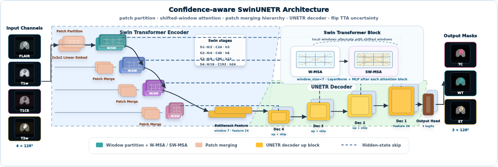
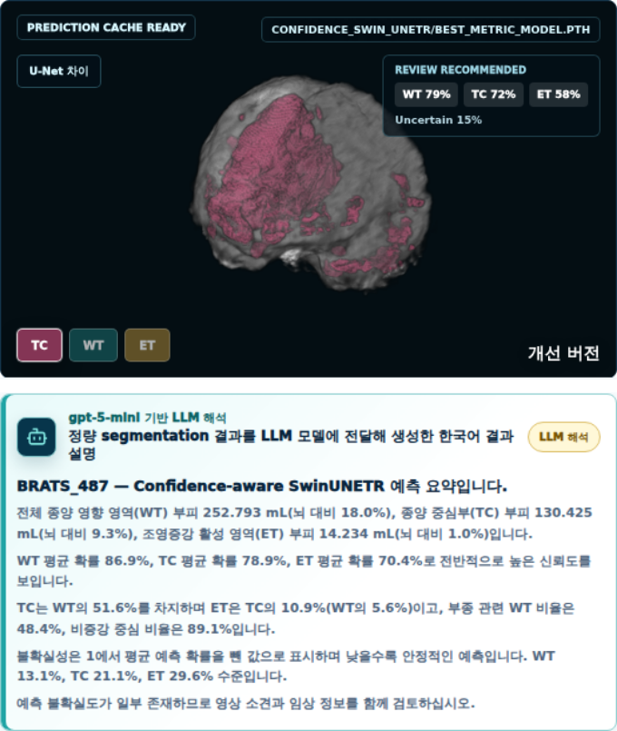

# Brain MRI Projects

Brain MRI를 대상으로 segmentation과 reconstruction 문제를 다룬 의료 AI 포트폴리오입니다. 모델 학습 결과를 notebook 안에만 남기지 않고, FastAPI serving과 frontend 시연 화면까지 연결해 실제로 설명 가능한 의료 AI 데모 형태로 구성했습니다.

## API Usage

이 프로젝트의 모델 serving API는 FastAPI 기반 `brain-mri` 컨테이너에서 실행됩니다. 컨테이너는 자동 재시작하지 않도록 설정되어 있으므로 필요할 때 직접 올려서 사용합니다.

```bash
cd /home/nami/repo/gpt_analysis/project/brainMRI
docker compose up -d brainmri
```

중지할 때는 다음 명령을 사용합니다.

```bash
cd /home/nami/repo/gpt_analysis/project/brainMRI
docker compose stop brainmri
```

기본 API 주소는 로컬 기준 `http://127.0.0.1:8010`입니다. 컨테이너가 정상 실행 중인지 먼저 health check로 확인합니다.

```bash
curl http://127.0.0.1:8010/api/health
```

정상 응답 예시는 다음과 같습니다.

```json
{
  "status": "ok",
  "service": "brainMRI"
}
```

### Segmentation API

Segmentation API는 `/api/brain-mri/segmentation` prefix를 사용합니다. `case_id`는 Decathlon test image 파일명에서 `.nii.gz`를 제거한 값입니다.

사용 가능한 test case 목록을 조회합니다.

```bash
curl http://127.0.0.1:8010/api/brain-mri/segmentation/cases
```

특정 case의 modality NIfTI를 생성하거나 조회합니다. `modality`는 `flair`, `t1w`, `t1gd`, `t2w` 중 하나입니다.

```bash
curl "http://127.0.0.1:8010/api/brain-mri/segmentation/cases/BRATS_001/modality-nifti?modality=flair"
```

Segmentation prediction을 실행하거나 캐시된 결과를 조회합니다. `model`은 `assignment` 또는 `enhanced`를 사용합니다.

```bash
curl "http://127.0.0.1:8010/api/brain-mri/segmentation/cases/BRATS_001/prediction?model=enhanced"
```

개선 모델과 baseline의 mask 차이를 조회합니다. `region`은 `wt`, `tc`, `et` 중 하나입니다.

```bash
curl "http://127.0.0.1:8010/api/brain-mri/segmentation/cases/BRATS_001/prediction-difference?model=enhanced&baseline=assignment&region=tc"
```

프론트 비교 패널에서 사용하는 2D comparison slice를 조회합니다.

```bash
curl "http://127.0.0.1:8010/api/brain-mri/segmentation/cases/BRATS_001/prediction-comparison-slice?model=enhanced&baseline=assignment&region=tc"
```

응답의 `niftiUrl`, `maskUrl`, `imageUrl` 값은 `/static/nifti-cache`, `/static/segmentation-cache` 아래의 정적 파일 경로입니다.

### Reconstruction API

Reconstruction API는 `/api/brain-mri/reconstruction` prefix를 사용합니다. `case_id`는 reconstruction test split의 case 번호입니다.

사용 가능한 reconstruction model 정보를 조회합니다.

```bash
curl http://127.0.0.1:8010/api/brain-mri/reconstruction/models
```

Dataset split 요약을 조회합니다.

```bash
curl http://127.0.0.1:8010/api/brain-mri/reconstruction/dataset/summary
```

Test case 목록을 조회합니다.

```bash
curl "http://127.0.0.1:8010/api/brain-mri/reconstruction/cases?split=test&limit=24"
```

특정 case의 입력 FLAIR/T1w/T2w와 target T1Gd sample을 조회합니다.

```bash
curl "http://127.0.0.1:8010/api/brain-mri/reconstruction/cases/3/sample?split=test"
```

특정 model의 synthetic T1Gd prediction을 실행하거나 캐시된 결과를 조회합니다. `model`은 `plain_unet`, `mamba_conv_unet`, `plain_gan`, `resvit_gan` 중 하나입니다.

```bash
curl "http://127.0.0.1:8010/api/brain-mri/reconstruction/cases/3/prediction?model=mamba_conv_unet&split=test"
```

두 모델의 metric summary를 조회합니다. `limit=5`는 기본 데모용 5개 case, `limit=all`은 전체 test split 기준입니다.

```bash
curl "http://127.0.0.1:8010/api/brain-mri/reconstruction/comparison/summary?models=plain_unet,mamba_conv_unet&split=test&limit=5"
```

응답의 reconstruction image URL은 `/static/reconstruction-cache` 아래의 정적 파일 경로입니다.

### Cache Behavior

Segmentation과 reconstruction API는 요청 시 필요한 cache 폴더와 파일을 다시 생성합니다. 기본 프론트 데모 5개 case는 `awesome/front/src/medical_ai/.../cache`에 정적 asset으로 들어가 있으므로, `brain-mri` 컨테이너가 내려가 있어도 기본 결과 화면은 표시됩니다. `다른 이미지 테스트`처럼 새 case를 API로 추론하는 기능은 `brain-mri` 컨테이너가 실행 중일 때만 사용할 수 있습니다.

## Segmentation

### 3D Brain Tumor Segmentation

이 프로젝트는 BraTS 3D brain MRI volume에서 종양 관련 영역을 voxel 단위로 분할하는 segmentation 실험입니다. 입력은 FLAIR, T1w, T1CE, T2w 네 가지 MRI modality를 쌓은 4-channel 3D volume이고, 출력은 의료 영상 분할에서 자주 사용하는 WT, TC, ET 세 가지 composite tumor region입니다.

| Region | Meaning | Clinical Role |
| --- | --- | --- |
| WT | Whole Tumor | 부종, 비증강 종양, 조영증강 종양을 포함한 전체 종양 영향 범위 |
| TC | Tumor Core | 부종을 제외한 종양 중심부 |
| ET | Enhancing Tumor | 조영증강되는 활성 종양 영역 |

### Problem Setting

뇌종양 MRI는 하나의 영상만으로 판단하기 어렵습니다. FLAIR는 부종과 병변 주변 신호를 잘 보여주고, T1w는 해부학적 구조를 제공합니다. T1CE는 조영증강 활성 종양을 확인하는 데 중요하며, T2w는 수분 함량과 병변 확산 범위를 보완합니다. 따라서 모델은 단일 slice classification이 아니라 4-channel 3D volume의 공간적 문맥을 함께 학습해야 합니다.

과제 제출용 baseline은 MONAI 3D U-Net으로 구성했습니다. U-Net은 의료 영상 segmentation에서 강한 기본 구조이지만, convolution 중심 구조만으로는 넓은 종양 주변 문맥이나 애매한 경계 영역의 불확실성을 충분히 설명하기 어렵다고 보았습니다. 그래서 portfolio 개선 버전에서는 SwinUNETR 기반 모델에 flip TTA를 붙여 예측 mask뿐 아니라 confidence와 uncertainty까지 함께 제공하도록 구성했습니다.



### Experiment Setup

| Item | Setup |
| --- | --- |
| Dataset | Decathlon Task01 BrainTumour / BraTS-style 3D MRI |
| Input shape | `[240, 240, 155, 4]` |
| Input channels | FLAIR, T1w, T1CE, T2w |
| Output regions | WT, TC, ET |
| Baseline | MONAI 3D U-Net |
| Enhanced model | Confidence-aware SwinUNETR + flip TTA |
| Evaluation split | Validation 24 cases |

### Quantitative Result

같은 validation 24 cases 기준으로 과제 제출용 3D U-Net과 개선 버전 SwinUNETR를 다시 비교했습니다.

| Region | 3D U-Net Dice | SwinUNETR Dice | Delta | 3D U-Net HD95 | SwinUNETR HD95 |
| --- | ---: | ---: | ---: | ---: | ---: |
| WT | 91.0% | 91.5% | +0.5p | 3.4 mm | 3.7 mm |
| TC | 84.6% | 84.8% | +0.3p | 6.1 mm | 6.2 mm |
| ET | 82.7% | 84.4% | +1.7p | 2.0 mm | 1.8 mm |

SwinUNETR는 세 region 모두에서 Dice가 개선되었고, 특히 ET Dice와 ET HD95가 함께 좋아졌습니다. 다만 WT/TC의 HD95는 baseline이 약간 더 낮았기 때문에, 개선 버전의 주장은 단순히 모든 수치가 압도적으로 좋아졌다는 것이 아닙니다. 이 프로젝트에서 강조한 지점은 Dice 개선과 함께 confidence, uncertainty, mask difference를 같이 보여주는 해석 가능한 inference pipeline입니다.

### Visual Evaluation Interface

서비스 화면에서는 기본 case 결과를 frontend asset으로 제공해 즉시 확인할 수 있게 했고, `다른 이미지 테스트`를 선택한 경우에만 FastAPI segmentation inference를 호출하도록 분리했습니다. 사용자는 같은 화면에서 3D mask viewer, case별 정량 요약, LLM 기반 한국어 결과 해석, U-Net과 SwinUNETR의 mask 차이, validation summary를 함께 확인할 수 있습니다.



### API-Backed Test Flow

새 test MRI를 선택하면 frontend는 파일명을 `{case_id}`로 사용해 FastAPI endpoint에 요청합니다. backend는 Decathlon test image 폴더에서 같은 파일명을 찾고, 4-channel MRI volume을 읽어 모델 inference를 수행합니다. 응답에는 NiiVue에서 바로 렌더링할 base MRI와 segmentation mask URL, WT/TC/ET voxel count, 부피, 뇌 대비 비율, 평균 확률, LLM 해석에 사용할 quantitative summary가 포함됩니다.

### Implementation Notes

- FastAPI backend에서 case 목록, modality NIfTI 변환, segmentation prediction, model difference, comparison slice API를 제공합니다.
- 기본 demo case는 frontend asset으로 고정해 페이지 로딩 즉시 결과를 볼 수 있게 했습니다.
- 다른 이미지 테스트를 선택할 때만 backend inference를 호출해 실제 API serving 흐름을 보여줍니다.
- backend inference는 GPU 컨테이너에서 실행되며, PyTorch CUDA device를 사용하도록 구성했습니다.
- output mask는 NiiVue 3D viewer로 렌더링하고, TC/WT/ET 버튼으로 관심 region을 중앙에 맞춰 회전하도록 만들었습니다.
- 개선 모델은 prediction mask 외에도 confidence, uncertainty, U-Net 대비 차이 영역을 함께 제공합니다.

### What I Focused On

이 segmentation 파트에서 가장 신경 쓴 부분은 “정답 mask와 비슷한 결과를 냈다”에서 끝내지 않는 것이었습니다. 의료 영상 분할 결과는 실제로 어디가 종양인지, 어떤 영역이 불확실한지, baseline과 개선 모델이 왜 다르게 판단했는지를 설명할 수 있어야 합니다. 그래서 모델 결과를 3D viewer, 정량 테이블, uncertainty 해석, LLM 설명, API 테스트 플로우까지 하나의 화면에 묶었습니다.

결과적으로 이 프로젝트는 3D U-Net baseline을 구현한 과제 제출물에서 출발해, SwinUNETR 기반 개선 모델과 해석 가능한 serving UI까지 확장한 end-to-end segmentation 작업입니다.

## Reconstruction

### 2D Brain MRI T1Gd Synthesis

이 프로젝트는 조영증강 T1Gd MRI를 직접 촬영하지 않고, 비조영 또는 기본 촬영 시퀀스인 FLAIR, T1w, T2w 2D slice로부터 synthetic T1Gd slice를 생성하는 reconstruction 실험입니다. 의료 영상에서 조영제 사용은 병변 확인에 중요하지만, 환자 부담과 촬영 조건의 제약이 존재합니다. 그래서 입력 가능한 MRI 시퀀스만으로 조영 후 영상을 보조적으로 합성할 수 있는지를 모델과 서비스 화면으로 검증했습니다.

### Problem Setting

입력은 3-channel MRI slice입니다.

| Channel | Role |
| --- | --- |
| FLAIR | 부종과 병변 주변 신호를 강조하는 입력 채널 |
| T1w | 해부학적 구조와 조직 경계를 보존하는 입력 채널 |
| T2w | 수분 함량과 병변 범위를 보완하는 입력 채널 |

출력은 1-channel synthetic T1Gd slice입니다. 모델은 세 입력 시퀀스의 상호 보완 정보를 이용해 조영증강 영상의 intensity map을 복원하도록 학습됩니다.

### Model Direction

baseline은 Plain U-Net으로 잡았습니다. U-Net은 의료 영상 복원에서 강한 기본 구조이지만, convolution 중심 구조만으로는 장거리 문맥과 slice 전역의 intensity 변화를 충분히 반영하기 어렵다고 판단했습니다.

이를 보완하기 위해 Mamba-style selective scan 개념을 U-shaped encoder-decoder 안에 결합한 Mamba-Conv U-Net을 비교 모델로 설계했습니다. 전체 구조는 multi-scale reconstruction scaffold를 유지하면서, encoder 구간에서는 국소 texture와 병변 주변 정보를 추출하고 bottleneck에서는 axial scan 기반 장거리 문맥을 압축합니다. decoder에서는 gated skip fusion으로 encoder feature를 결합해 T1Gd 복원 결과를 생성합니다.


### Experiment Setup

| Split | Cases |
| --- | ---: |
| Train | 6,000 |
| Validation | 750 |
| Test | 750 |

평가는 전체 test set 750 cases 기준으로 수행했습니다. 정량 지표는 절대 오차 계열인 MAE/RMSE와 구조 유사도 계열인 PSNR/SSIM을 함께 사용했습니다. MAE와 RMSE는 낮을수록 좋고, PSNR과 SSIM은 높을수록 좋습니다.

### Quantitative Result

| Metric | Plain U-Net | Mamba-Conv U-Net | Delta | Better |
| --- | ---: | ---: | ---: | --- |
| MAE | 0.0094 | 0.0091 | -0.0003 | Mamba |
| RMSE | 0.0258 | 0.0253 | -0.0005 | Mamba |
| PSNR | 32.04 dB | 32.23 dB | +0.1890 dB | Mamba |
| SSIM | 0.3353 | 0.3364 | +0.0010 | Mamba |

Mamba-Conv U-Net은 Plain U-Net 대비 모든 평균 지표에서 우세했습니다. 특히 MAE/RMSE가 낮아졌다는 점은 전체 intensity 오차가 줄었다는 의미이고, PSNR/SSIM 개선은 복원 영상의 구조적 일관성이 조금 더 안정적으로 유지되었음을 보여줍니다. 수치 차이가 크지는 않지만, 동일한 입력 조건에서 전체 test set 평균이 같은 방향으로 움직였다는 점이 의미 있습니다.

### Visual Evaluation Interface

서비스 화면에서는 고정 case 결과를 frontend asset으로 제공하고, 별도의 test image 선택 시에만 API inference가 수행되도록 구성했습니다. 포트폴리오 화면에서는 정적 결과와 실시간 테스트 흐름을 분리해, 사용자가 모델 비교 결과를 빠르게 확인하면서도 새로운 파일에 대한 추론을 실행할 수 있게 했습니다.


### Implementation Notes

- FastAPI backend에서 reconstruction model 목록, case sample, prediction API를 제공합니다.
- frontend 기본 case는 미리 저장한 asset을 사용해 API 대기 없이 바로 렌더링합니다.
- 다른 이미지 테스트를 선택한 경우에만 backend inference를 호출합니다.
- prediction 결과는 input, target, baseline, enhanced model output, error map과 metric table로 연결됩니다.
- model checkpoint와 dataset은 git에서 제외하고, README에는 재현 가능한 구조와 결과 중심으로 정리했습니다.

### What I Focused On

이 프로젝트에서 단순히 모델 하나를 학습하는 데서 멈추지 않고, 연구 결과를 설명 가능한 화면으로 연결하는 데 집중했습니다. 모델 구조, 입력 채널 의미, case별 시각 비교, 전체 test set metric, 실시간 inference 흐름을 하나의 페이지에서 확인할 수 있게 만들었습니다. 의료 AI 포트폴리오에서는 좋은 수치뿐 아니라 결과를 어떻게 해석하고 전달하는지도 중요하다고 보았기 때문입니다.

결과적으로 이 reconstruction 파트는 “MRI 합성 모델을 만들었다”가 아니라, 데이터 전처리, 모델 설계, 정량 평가, 시각 비교, API serving, frontend presentation까지 하나의 end-to-end 실험으로 구성한 작업입니다.
