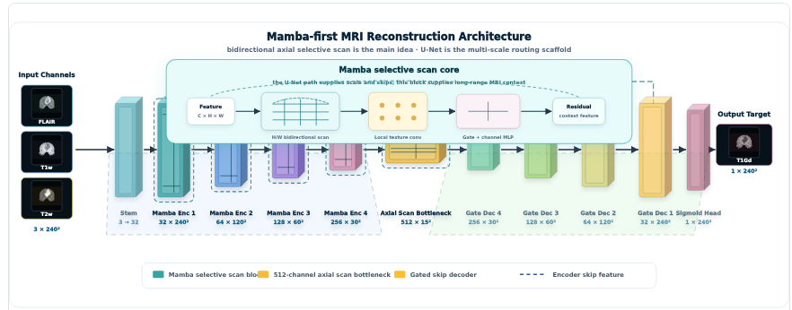
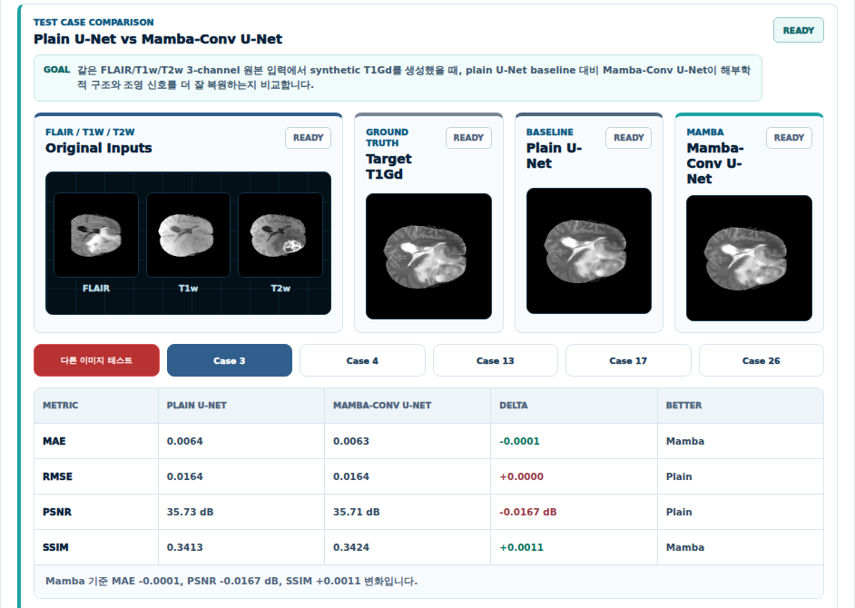

# Brain MRI Projects

Brain MRI를 대상으로 segmentation과 reconstruction 문제를 다룬 의료 AI 포트폴리오입니다. 현재 문서는 두 축으로 구성되어 있으며, 이 README에서는 먼저 2D MRI reconstruction 프로젝트를 정리합니다.

## Segmentation

3D Brain MRI tumor segmentation 파트는 별도 정리 예정입니다.

## Reconstruction

### 2D Brain MRI T1Gd Synthesis

이 프로젝트는 조영증강 T1Gd MRI를 직접 촬영하지 않고, 비조영 또는 기본 촬영 시퀀스인 FLAIR, T1w, T2w 2D slice로부터 synthetic T1Gd slice를 생성하는 reconstruction 실험입니다. 의료 영상에서 조영제 사용은 병변 확인에 중요하지만, 환자 부담과 촬영 조건의 제약이 존재합니다. 그래서 입력 가능한 MRI 시퀀스만으로 조영 후 영상을 보조적으로 합성할 수 있는지를 모델과 서비스 화면으로 검증했습니다.

### Problem Setting

입력은 3-channel MRI slice입니다.

| Channel | Role |
| --- | --- |
| FLAIR | 부종과 병변 주변 신호를 강조하는 입력 채널 |
| T1w | 해부학적 구조와 조직 경계를 보존하는 입력 채널 |
| T2w | 수분 함량과 병변 범위를 보완하는 입력 채널 |

출력은 1-channel synthetic T1Gd slice입니다. 모델은 세 입력 시퀀스의 상호 보완 정보를 이용해 조영증강 영상의 intensity map을 복원하도록 학습됩니다.

### Model Direction

baseline은 Plain U-Net으로 잡았습니다. U-Net은 의료 영상 복원에서 강한 기본 구조이지만, convolution 중심 구조만으로는 장거리 문맥과 slice 전역의 intensity 변화를 충분히 반영하기 어렵다고 판단했습니다.

이를 보완하기 위해 Mamba-style selective scan 개념을 U-shaped encoder-decoder 안에 결합한 Mamba-Conv U-Net을 비교 모델로 설계했습니다. 전체 구조는 multi-scale reconstruction scaffold를 유지하면서, encoder 구간에서는 국소 texture와 병변 주변 정보를 추출하고 bottleneck에서는 axial scan 기반 장거리 문맥을 압축합니다. decoder에서는 gated skip fusion으로 encoder feature를 결합해 T1Gd 복원 결과를 생성합니다.

### Experiment Setup

| Split | Cases |
| --- | ---: |
| Train | 6,000 |
| Validation | 750 |
| Test | 750 |

평가는 전체 test set 750 cases 기준으로 수행했습니다. 정량 지표는 절대 오차 계열인 MAE/RMSE와 구조 유사도 계열인 PSNR/SSIM을 함께 사용했습니다. MAE와 RMSE는 낮을수록 좋고, PSNR과 SSIM은 높을수록 좋습니다.

### Quantitative Result

| Metric | Plain U-Net | Mamba-Conv U-Net | Delta | Better |
| --- | ---: | ---: | ---: | --- |
| MAE | 0.0094 | 0.0091 | -0.0003 | Mamba |
| RMSE | 0.0258 | 0.0253 | -0.0005 | Mamba |
| PSNR | 32.04 dB | 32.23 dB | +0.1890 dB | Mamba |
| SSIM | 0.3353 | 0.3364 | +0.0010 | Mamba |

Mamba-Conv U-Net은 Plain U-Net 대비 모든 평균 지표에서 우세했습니다. 특히 MAE/RMSE가 낮아졌다는 점은 전체 intensity 오차가 줄었다는 의미이고, PSNR/SSIM 개선은 복원 영상의 구조적 일관성이 조금 더 안정적으로 유지되었음을 보여줍니다. 수치 차이가 크지는 않지만, 동일한 입력 조건에서 전체 test set 평균이 같은 방향으로 움직였다는 점이 의미 있습니다.

### Visual Evaluation Interface

서비스 화면에서는 고정 case 결과를 frontend asset으로 제공하고, 별도의 test image 선택 시에만 API inference가 수행되도록 구성했습니다. 포트폴리오 화면에서는 정적 결과와 실시간 테스트 흐름을 분리해, 사용자가 모델 비교 결과를 빠르게 확인하면서도 새로운 파일에 대한 추론을 실행할 수 있게 했습니다.

### Implementation Notes

- FastAPI backend에서 reconstruction model 목록, case sample, prediction API를 제공합니다.
- frontend 기본 case는 미리 저장한 asset을 사용해 API 대기 없이 바로 렌더링합니다.
- 다른 이미지 테스트를 선택한 경우에만 backend inference를 호출합니다.
- prediction 결과는 input, target, baseline, enhanced model output, error map과 metric table로 연결됩니다.
- model checkpoint와 dataset은 git에서 제외하고, README에는 재현 가능한 구조와 결과 중심으로 정리했습니다.

### What I Focused On

이 프로젝트에서 단순히 모델 하나를 학습하는 데서 멈추지 않고, 연구 결과를 설명 가능한 화면으로 연결하는 데 집중했습니다. 모델 구조, 입력 채널 의미, case별 시각 비교, 전체 test set metric, 실시간 inference 흐름을 하나의 페이지에서 확인할 수 있게 만들었습니다. 의료 AI 포트폴리오에서는 좋은 수치뿐 아니라 결과를 어떻게 해석하고 전달하는지도 중요하다고 보았기 때문입니다.

결과적으로 이 reconstruction 파트는 “MRI 합성 모델을 만들었다”가 아니라, 데이터 전처리, 모델 설계, 정량 평가, 시각 비교, API serving, frontend presentation까지 하나의 end-to-end 실험으로 구성한 작업입니다.
